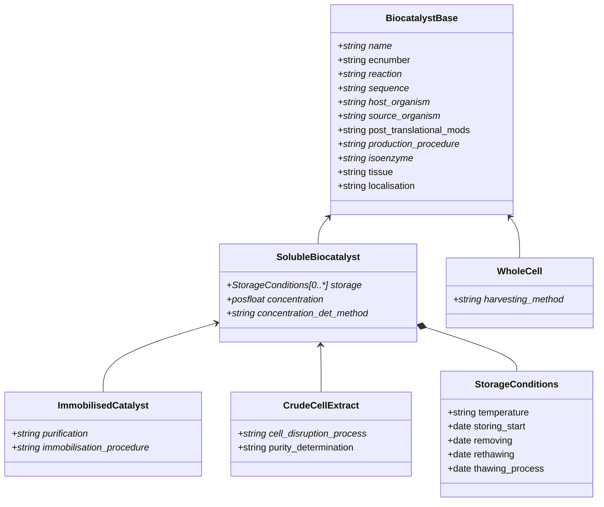

```mermaid
classDiagram
    BiocatalystBase <-- SolubleBiocatalyst
    SolubleBiocatalyst <-- ImmobilisedCatalyst
    SolubleBiocatalyst <-- CrudeCellExtract
    BiocatalystBase <-- WholeCell
    SolubleBiocatalyst *-- StorageConditions
    
    class BiocatalystBase {
        +string name*
        +string ecnumber
        +string reaction*
        +string sequence*
        +string host_organism*
        +string source_organism*
        +string post_translational_mods
        +string production_procedure*
        +string isoenzyme*
        +string tissue
        +string localisation
    }
    
    class SolubleBiocatalyst {
        +StorageConditions[0..*] storage*
        +posfloat concentration*
        +string concentration_det_method*
    }
    
    class ImmobilisedCatalyst {
        +string purification*
        +string immobilisation_procedure*
    }
    
    class CrudeCellExtract {
        +string cell_disruption_process*
        +string purity_determination
    }
    
    class WholeCell {
        +string harvesting_method*
    }
    
    class StorageConditions {
        +string temperature
        +date storing_start
        +date removing
        +date rethawing
        +date thawing_process
    }
    
```