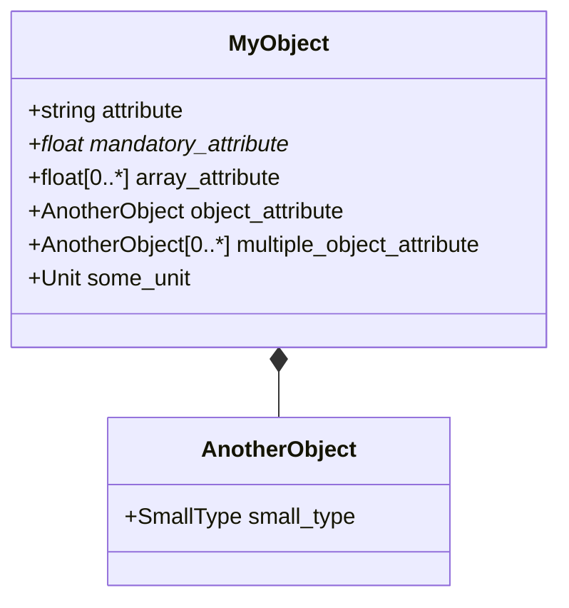

```mermaid
classDiagram
    MyObject *-- AnotherObject
    
    class MyObject {
        +string attribute
        +float mandatory_attribute*
        +float[0..*] array_attribute
        +AnotherObject object_attribute
        +AnotherObject[0..*] multiple_object_attribute
        +Unit some_unit
    }
    
    class AnotherObject {
        +SmallType small_type
    }
    
```